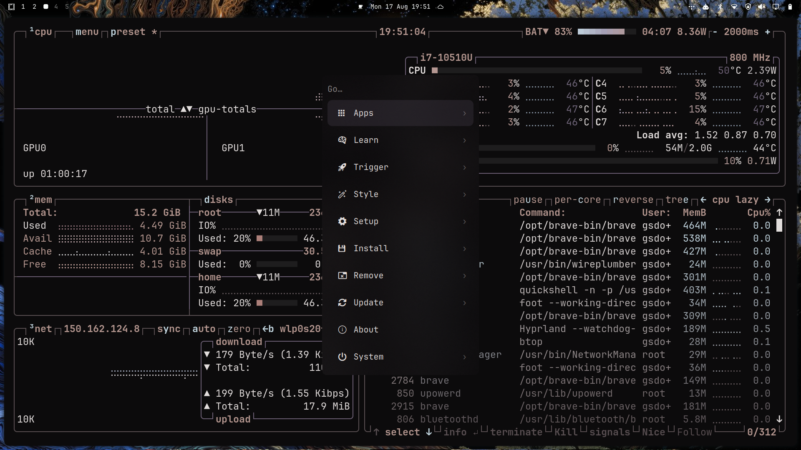

# Ianacob

An Omarchy theme shaped by deep blacks, luminous whites, and muted rose and blue accents. Ianacob pairs a restrained interface with surreal, dreamlike skies.

Ianacob began as a fork of [Last Horizon](https://github.com/HANCORE-linux/omarchy-lasthorizon-theme) by HANCORE Linux. It has since evolved into a distinct theme with its own palette, configuration, and visual identity.

## Screenshot



## Installation

Ianacob includes custom Hyprland behavior in `hyprland.lua`, including its
rounding, single-window gaps and border rule, opacity, blur, and animations.
Omarchy deliberately ignores Lua files when a theme is installed directly from
a Git repository, so `omarchy theme install` installs the palette but not those
parts of the theme.

For the complete theme, clone it to a working directory and link that directory
into Omarchy after reviewing the Lua file:

```bash
git clone https://github.com/GustavoDorow/omarchy-ianacob-theme.git ~/Src/omarchy-tools/omarchy-ianacob-theme
ln -s ~/Src/omarchy-tools/omarchy-ianacob-theme ~/.config/omarchy/themes/ianacob
omarchy theme set ianacob
```

If `~/.config/omarchy/themes/ianacob` already exists from a previous
`omarchy theme install`, move or remove that directory before creating the
link.

For a palette-only installation, use:

```bash
omarchy theme install https://github.com/GustavoDorow/omarchy-ianacob-theme.git
```

## Related projects

- [Waybar Themes](https://github.com/HANCORE-linux/waybar-themes)
- [Theme Hook Plugin Manager](https://github.com/OldJobobo/theme-hook-plugin-manager)

## Wallpaper credits

The following wallpapers are artwork by [Mac Baconai](https://x.com/macbaconai):

- `backgrounds/G8ny5RwXEAEddQi.jpeg`
- `backgrounds/GeYZxYzXgAAZcvT.jpeg`

## License

The theme configuration is licensed under the [MIT License](./LICENSE). Wallpaper artwork remains the property of its respective creator.
